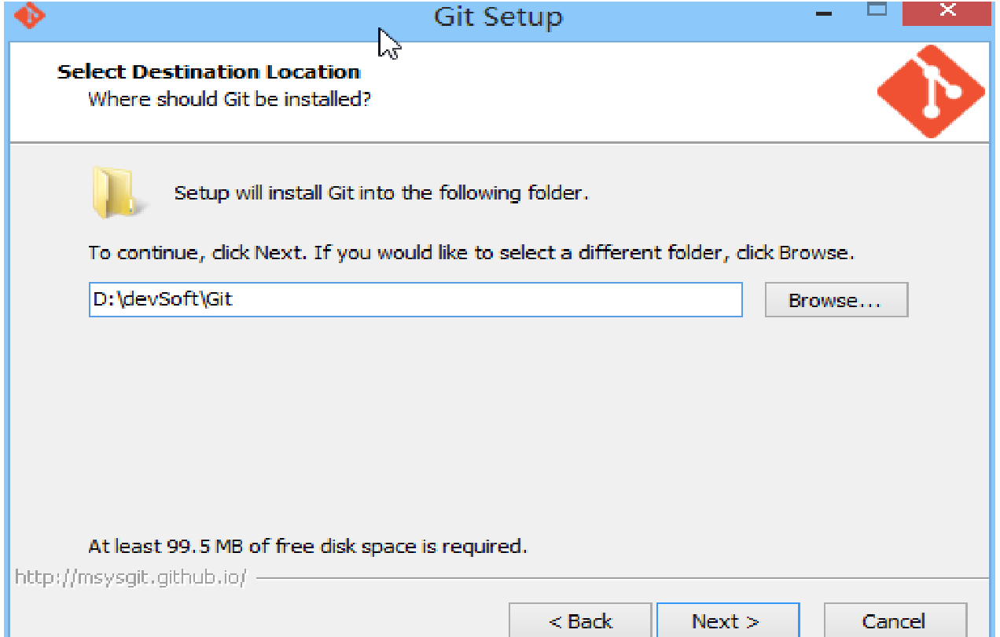
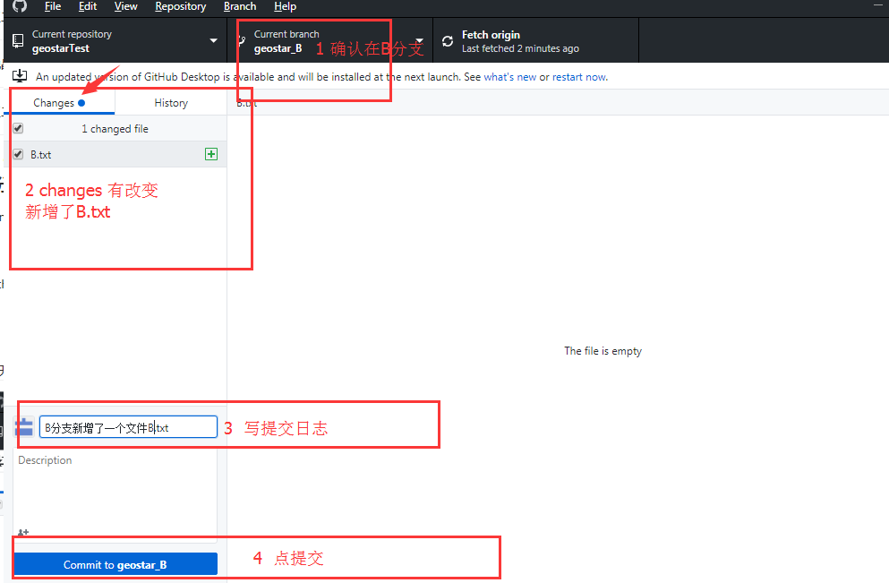

# Git	

## Git是什么


Git是实现分布式版本控制的一个工具，简单的来说就是实现文件历史管理的工具。

## Git下载安装

去[Git官网](https://git-scm.com/)下载对应操作系统的Git。

### window

#### 下载

git官网（[下载Git](https://git-scm.com/download/win)）


下载速度炒鸡慢给大家一个快速的传送门（转载其他大佬）https://npm.taobao.org/mirrors/git-for-windows/


#### 安装

除了以下几步需要修改，其它默认next


解压到哪个文件夹





桌面快捷方式


在“Configuring the line ending conversions”选项中，
	第一个选项：如果是跨平台项目，在windows系统安装，选择；
	第二个选项：如果是跨平台项目，在Unix系统安装，选择；
	第三个选项：非跨平台项目，选择。


#### 配置

配置环境变量


配置git：用户名和邮箱  --> 在桌面右键-【Git Bash Here】


输入命令：

```sh
git config --global user.name "lijiang"

git config --global user.email "2906718132@qq.com"
```


查看用户名和邮箱是否配置成功，去这个路径：C:\Users\Lijiang，找到.gitconfig文件并打开，如果有下面这些内容就说明成功了


#### 验证

打开下载目录


键盘Ctrl+r，然后在弹出框中出入cdm，弹出如下界面，输入git，回车


安装成功


### linux （ubuntu）

#### 下载安装 

在终端输入

```csharp
sudo apt-get install git
```

输入密码安装即可。

#### 配置

windows打开GitBash，macos和linux用户打开终端。
 首先要设置自己的身份，比如git提交代码的时候要让别人知道什么人提交了代码，

设置身份内容有两条，一个是你的邮箱，另一个是你的称呼 ，以后你提交的代码都根据这个来确定是你
 提交的的了。Your Name填你想让别人知道的名字，[email@example.com](mailto:email@example.com)换成自己的邮箱。

自此以后你写的bug就会被人认出来是你写的了。

输入：

```csharp
$ git config --global user.name "Your Name"
$ git config --global user.email "email@example.com"
```


## Git常用场景

### Local Git仓库操作

windows和mac的使用命令相同，这里不做赘述，讲一下linux （ubuntu）的，其他linux系统的玩家水平应该都很高，不需要看教程～～

#### 初始化本地git仓库

从终端（cmd）进入你想要记录内容更改的文件夹里
 例如我们进入`gittest`文件夹
 输入：

```kotlin
git init
```

这个文件夹以后的更改就会被记录了。（如果是空文件夹会提示`Initialized empty Git repository in /home/yep/code/gittest/.git/`，告诉你文件夹为空）

现在我们在文件夹里新建一个文件hello.txt,内容是

```bash
print("Hello World")
```


#### 将文件提交到仓库

现在我们要把这个文件放入git仓库。

和把大象放到冰箱需要3步相比，把一个文件放到Git仓库只需要两步。

第一步：保存后，我们使用`git add`命令，告诉git我们把文件添加到仓库缓存区了，在终端输入

```csharp
git add hello.txt
```

没有提示说明操作成功。

第二步：使用`git commit`命令，告诉git我们要把缓存区的所有文件正式提交到仓库：

```bash
git commit -m "添加了hello.txt"
```

其中 -m 和后面引号内容是本次提交的说明，也就是描述你每次改了什么。

嫌麻烦不想输入-m "xxx"行不行？确实有办法可以这么干，但是强烈不建议你这么干，因为输入说明对自己对别人阅读都很重要。实在不想输入说明的童鞋请自行Google，我不告诉你这个参数。

```css
[master (root-commit) ec4652d] 添加了hello.txt
 1 file changed, 1 insertion(+)
 create mode 100644 hello.txt
```

git commit命令执行成功后会告诉你，`1 file changed`：1个文件被改动（我们新添加的hello.txt文件）；`1 insertions`：插入了两行内容（hello.txt有一行内容）。

为什么Git添加文件需要`add`，`commit`一共两步呢？因为`commit`可以一次提交很多文件，所以你可以多次`add`不同的文件，比如：

```ruby
$ git add file1.txt
$ git add file2.txt file3.txt
$ git commit -m "add 3 files."
```

`add`把文件放到了缓存区，然后`commit`正式提交到仓库。

#### 查看提交记录信息

现在修改hello.txt里的内容：

```bash
print("Hello World")
print("老板是神经病")
```

因为对工作很不满，下班前添加了第二行，“老板是神经病”,然后提交

```csharp
git add hello.txt
git commit -m "hello.txt里添加了一句话"
```

提示：

```css
[master 88d885c] 在hello.txt添加了一句话
 1 file changed, 2 insertions(+), 1 deletion(-)
```

像这样，你不断对文件进行修改，然后不断提交修改到版本库里，就好比玩RPG游戏时，每通过一关就会自动把游戏状态存盘，如果某一关没过去，你还可以选择读取前一关的状态。有些时候，在打Boss之前，你会手动存盘，以便万一打Boss失败了，可以从最近的地方重新开始。Git也是一样，每当你觉得文件修改到一定程度的时候，就可以“保存一个快照”，这个快照在Git中被称为commit。一旦你把文件改乱了，或者误删了文件，还可以从最近的一个commit恢复，然后继续工作，而不是把几个月的工作成果全部丢失。

现在，我们回顾一下hello.txt文件一共有几个版本被提交到Git仓库里了：

版本1：添加了hello.txt

版本2：在hellotxt添加了几句话

到了第二天早上你后悔了，想回到昨天下班前代码的状态

当然了，在实际工作中，我们脑子里怎么可能记得一个几千行的文件每次都改了什么内容，不然要版本控制系统干什么。版本控制系统肯定有某个命令可以告诉我们历史记录，在Git中，我们用git log命令查看：
 输入`git log`命令查看版本情况
 输入：

```bash
git log
```

显示了过去所有的修改时间、修改人、修改内容：

```tsx
commit 88d885c21216cbedacb1692e08d51afa6d4e32a7 (HEAD -> master)
Author: yepdlpc <mattbaisteins@gmail.com>
Date:   Wed Dec 19 20:13:22 2018 +0800

    在hello.txt添加了一句话

commit ec4652d5d0b8662fc8730d64b42341d1c363a442
Author: yepdlpc <mattbaisteins@gmail.com>
Date:   Wed Dec 19 20:11:42 2018 +0800

    添加了hello.txt
```

yepdlpc和邮箱都是我的。。我们可以看到，最新的提交在最上面，并按时间有近到远。并且每一次提交修改都生成了一个commit id，我们可以认为这个id是当时的这个版本的版本号，这个commit id是我们找回当时版本的`唯一凭据`。

我们只有两次提交，只需要回到`ec645.......`这个commit id时的版本就行。

#### 实现版本次数回退

Git中使用HEAD表示当前版本，也就是`commit 88d885c21216cbedacb1692e08d51afa6d4e32a7`，

`HEAD^`表示上一个版本，`HEAD^^`表示上上一个版本，当然往上100个版本写100个`^`比较容易数不过来，所以写成`HEAD~100`。

现在，我们要把当前版本回退到上一个版本，就可以使用`git reset`命令：

```undefined
git reset --hard HEAD^
```

`--hard`参数有啥意义？这个后面再讲，现在你先放心使用。

此时我们可以看到hello.txt的文件内容变回了：

```bash
print("Hello World")
```

果然被还原了。

还可以继续回退到上一个版本，不过且慢，然我们用`git log`再看看现在版本库的状态：

```css
Author: yepdlpc <mattbaisteins@gmail.com>
Date:   Wed Dec 19 20:11:42 2018 +0800

    添加了hello.txt
```

最新的那个版本`88d885c21216cbedacb1692e08d51afa6d4e32a7`已经看不到了！好比你从21世纪坐时光穿梭机来到了19世纪，想再回去已经回不去了，肿么办？

#### 实现指定版本回退

办法其实还是有的，只要上面的命令行窗口还没有被关掉，你就可以顺着往上找啊找啊，找到那个commit id是`88d885c21216cbedacb1692e08d51afa6d4e32a7`，于是就可以指定回到未来的某个版本：

```undefined
git reset --hard 88d885
```

版本号没必要写全，前几位就可以了，Git会自动去找。当然也不能只写前一两位，因为Git可能会找到多个版本号，就无法确定是哪一个了。

我们再看hello.txt的内容：

```bash
print("Hello World!")
print("老板是神经病")
```

果然，我胡汉三又回来了。

Git的版本回退速度非常快，因为Git在内部有个指向当前版本的HEAD指针，当你回退版本的时候，Git仅仅是把HEAD从指向某个版本：


现在，你回退到了某个版本，关掉了电脑，第二天早上就后悔了，想恢复到新版本怎么办？找不到新版本的`commit id`怎么办？

在Git中，总是有后悔药可以吃的。当你用`$ git reset --hard HEAD^`回退到旧版本时，再想恢复到新版本，就必须找到新版本的的commit id。
 Git提供了一个命令`git reflog`用来记录你的每一次命令：

```kotlin
$ git reflog
88d885c (HEAD -> master) HEAD@{0}: reset: moving to 88d885c21216cbedacb1692e08d51afa6d4e32a7
ec4652d HEAD@{1}: reset: moving to HEAD^
88d885c (HEAD -> master) HEAD@{2}: commit: 在hello.txt添加了一句话
ec4652d HEAD@{3}: commit (initial): 添加了hello.txt
```

后悔药来了

### 远程 Git仓库常用操作

使用Github当作远程git仓库。为什么要使用github呢？

那是因为学会使用Git后我们的团队合作能力大大提升，我们可以设置一台代码仓库服务器，本地提交完成（commit）后将代码与仓库同步，就能实现分布式版本控制了。

然而，为一个小项目单独设立仓库服务器成本有些高，另外，自己搭建的物理主机服务器难免会有故障，我们也很难保障网络（独立ip很贵），于是，大胆的想法就出现了！

没错！就是上云啦！GitHub就是这样一家提供免费代码仓库的公司，它是由Git之父、linux之父linus成立的（git其实是linus为了维护linux开发的）为广大程序员提供远程代码仓库的伟大公司～～

前不久被微软收购了。

页面大概是这样：


 每个用户有一个类似博客的主页，和很多仓库（一个项目一个仓库），程序员把自己写的代码上传到GitHub来托管，因为是大公司在管，你不必担心它的服务器会挂掉，在全球任何有网络的地方你都可以开始工作！
 没错，很多公司也使用GitHub管理他们的项目


大概有三种用途：
 1.合作开发

如果有多个人一起开发某项目，把仓库设在GitHub，大家在各自笔记本写代码、修改使用git上传、同步，避免了复制粘贴代码，而且还能实现版本控制，谁修改了什么内容一清二楚，连谁写了多少行改了多少行代码都能统计清楚。摸鱼是不可能的。

2.软件仓库
 GitHub提供两种仓库私有仓库和公开仓库。
 GitHub免费为所有用户提供公开仓库空间，公开仓库向网络公开，所有人都能访问，但只有所有者和授权用户才能修改。
 私有仓库不对外公开，但要向GitHub付费。

3.代码公开
 这一条应该是最有用的了，你可以在这里找到全世界程序员的劳动成果，上到各种算法实现、下到各种app源码。只要遵循开源协议，你都可以copy下来用。

#### window

注册账号[GitHub官网](https://github.com)

##### 本地创建SSH KEY

搭建git服务器（远程仓库）：统一的托管网站（[https://github.com/](https://link.zhihu.com/?target=https%3A//github.com/)）

为了在本地和远程仓库之间进行 免密钥登录，可以配置ssh。

配置ssh:先在本地配置，再发送给远程

先查看是否有.ssh文件，输入命令：cd ~/.ssh

出现no such file or directory表示没有.ssh文件，如下：


如果没有.ssh文件，我们就需要生成本地ssh文件了，只需输入命令：**ssh-keygen -t rsa -C "2906718132@qq.COM" 特别注意大小写和空格，用大写的C ！！！三次回车后，就生成了本地ssh了**


##### SSH KEY发送给远程

里面有`id_rsa`和`id_rsa.pub`两个文件，这两个就是SSH Key的秘钥对，`id_rsa`是私钥，不能泄露出去，`id_rsa.pub`是公钥，可以放心地告诉任何人。
 打开id_rsa.pub,复制里面的内容。
 然后，登陆GitHub，打开“Account settings”，“SSH Keys and GPG keys”页面：

然后，点“New SSH Key”，填上任意Title，在Key文本框里粘贴id_rsa.pub文件的内容即可。


##### 测试连通性

看本地仓库和远程仓库是否连接成功，输入命令：**ssh -T git@github.com**


##### 本地新建git项目

`git init`

在需要发送的项目的文件夹的**根目录**下右键【git bash here】


##### 远程建立git项目

https://github.com/new


下面的字符串就是远程项目的唯一标识符，有两种方式，HTTPS和ssh


##### 本地-远程项目关联

入命令：**git remote add origin** **git@github.com:LiJiangJiangJiang/myGitProjectRemote.git 注意：橘黄色的是远程项目的唯一标识符**


##### 第一次发布项目 

（本地-远程）

**git add .** //文件-暂存区,add后面是“**空格 点**”就表示当前目录的所有文件（**注意：add和点中间有一个空格！！！大坑**）

**git commit -m** **“注释内容”** //暂存区-本地分支（默认master）

**git push -u origin master**


然后现在GitHub官网上就关联了本地项目：


##### 第一次下载项目

(远程-本地）：git clone git@XXX


然后找一个存放该项目的文件夹，并在**此文件夹**里面右键【git bash here】，**输入命令：git clone XXX （注意：“XXX”是刚刚复制的唯一标识符）**


然后可以看到该项目就下载到刚刚新建的本地文件夹“myGitProjectRemote”了。此时会发现版本的管理目录“.git”也过来了


##### 提交项目

（本地-远程），三步走

在当前工作目录，右键【git bash here】

**git add .**

**git commit -m "提交内容"**

**git push origin master （注意：这是非第一次提交，所以没有“-u”）**


##### 更新项目

（远程-本地），命令：**git pull**


#### Linux(Ubantu)

##### 注册账号

[GitHub官网](https://github.com)

在了解之前，先注册github账号，由于你的本地Git仓库和github仓库之间的传输是通过SSH加密的，所以需要一点设置

##### 创建SSH Key

在用户主目录下，看看有没有.ssh目录，如果有，再看看这个目录下有没有id_rsa和id_rsa.pub这两个文件，如果已经有了，可直接跳到下一步。如果没有，打开Shell（Windows下打开Git Bash），创建SSH Key：

```sh
root@kali:~/CTFD# ssh-keygen -t rsa -C "fatpuffer@163.com"

Generating public/private rsa key pair.
Enter file in which to save the key (/root/.ssh/id_rsa): 
Enter passphrase (empty for no passphrase): 
Enter same passphrase again: 
Your identification has been saved in /root/.ssh/id_rsa.
Your public key has been saved in /root/.ssh/id_rsa.pub.
The key fingerprint is:
SHA256:AU5KedsTeK/PH7UCkATDOehjQIqpnAEidz2CBOSTUc8 fatpuffer@163.com
The key's randomart image is:
+---[RSA 2048]----+
|**=oo==+.        |
|*+=o*+O+o.       |
|+= o.E.*+o       |
|o + + . oo.      |
|.o . .  So.   .  |
|        .  . . . |
|         o  o .  |
|          o  o   |
|           ..    |
+----[SHA256]-----+
```


你需要把邮件地址换成你自己的邮件地址，然后一路回车，使用默认值即可，由于这个Key也不是用于军事目的，所以也无需设置密码。

如果一切顺利的话，可以在用户主目录里找到.ssh目录，里面有`id_rsa`和`id_rsa.pub`两个文件，这两个就是SSH Key的秘钥对，`id_rsa`是私钥，不能泄露出去，`id_rsa.pub`是公钥，可以放心地告诉任何人。

```sh
root@kali:~# cd .ssh/

root@kali:~/.ssh# ls
id_rsa  id_rsa.pub  known_hosts

root@kali:~/.ssh#
```


 打开id_rsa.pub,复制里面的内容。

##### 设置远程SSH KEY

登陆GitHub，打开“Account settings”，“SSH Keys and GPG keys”页面：

然后，点“New SSH Key”，填上任意Title，在Key文本框里粘贴id_rsa.pub文件的内容即可。


点“Add Key”，你就应该看到已经添加的Key。

为什么GitHub需要SSH Key呢？因为GitHub需要识别出你推送的提交确实是你推送的，而不是别人冒充的，而Git支持SSH协议，所以，GitHub只要知道了你的公钥，就可以确认只有你自己才能推送。

当然，GitHub允许你添加多个Key。假定你有若干电脑，你一会儿在公司提交，一会儿在家里提交，只要把每台电脑的Key都添加到GitHub，就可以在每台电脑上往GitHub推送了。

最后友情提示，在GitHub上免费托管的Git仓库，任何人都可以看到喔（但只有你自己才能改）。所以，不要把敏感信息放进去。

##### 创建仓库

然后你可以创建仓库了
 首先，登陆GitHub，然后，在右上角找到“Create a new repo”按钮，创建一个新的仓库


 然后起一个项目名


 来到这个项目的主页


可以看到主页提供了两种和本地仓库关联起来的方式

#####  本地-远程建立链接方式一

目前，在GitHub上的这个CTFD仓库还是空的，GitHub告诉我们，可以从这个仓库克隆出新的仓库，也可以把一个已有的本地仓库与之关联，然后，把本地仓库的内容推送到GitHub仓库。

 把本地已有的同名Git仓库和GitHub上的仓库关联起来
 我们在本地新建了一个名为Gittest的文件夹

```kotlin
git init
```

将Gittest文件夹设置为Git仓库
 添加文件,比如我们新写了一个hello.txt：

```csharp
git add hello.txt
git commit -m "first commit"
```

到此为止已经提交到了本地仓库
 接下来我们把本地仓库和远程仓库联系起来

```csharp
git remote add origin git@github.com:MachinePlay/Gittest.git
```

> * 如果此时出现错误：`fatal: remote origin already exists`. 这时候说明远程仓库已经存在。这时候需要先删除origin仓库，然后再重新添加该远程仓库。指令如下
>
>   * ```sh
>     git remote rm origin
>     git remote add origin git@github.com:FatPuffer/CTFD.git
>     ```
>
> * 请千万注意，把上面的MachinePlay替换成你自己的GitHub账户名，否则，你在本地关联的就是我的远程库，关联没有问题，但是你以后推送是推不上去的，因为你的SSH Key公钥不在我的账户列表中。
>
> * 在这边额外记录以下创建pathy项目的django框架的命令
>
>   * ```sh
>     django-admin startproject CTFD
>     ```

添加后，远程库的名字就是origin，这是Git默认的叫法，也可以改成别的，但是origin这个名字一看就知道是远程库
 下一步，就可以把本地库的所有内容推送到远程库上

```undefined
git push -u origin master
```

由于远程库是空的，我们第一次推送master分支时，加上了-u参数，Git不但会把本地的master分支内容推送的远程新的master分支，还会把本地的master分支和远程的master分支关联起来，在以后的推送或者拉取时就可以简化命令。

此后`git add` `git commit-m`之后 就可以使用

```undefined
git push origin master
```

> - 如果此处报错，报错信息如下：
>
> ```sh
> To git@github.com:FatPuffer/CTFD.git
>  ! [rejected]        master -> master (non-fast-forward)
> error: failed to push some refs to 'git@github.com:FatPuffer/test.git'
> hint: Updates were rejected because the tip of your current branch is behind
> hint: its remote counterpart. Integrate the remote changes (e.g.
> hint: 'git pull ...') before pushing again.
> hint: See the 'Note about fast-forwards' in 'git push --help' for details.
> ```
>
> - 可能因为我们创建仓库时添加了`README.md`文件和`.gitignore`文件，系统会自动帮我们做一次提交，所以在我们推送时，系统版本比我们本地版本更优先，因此报错，解决办法：现将远程`master`分支提价拉倒本地，然后再提交。
>
> ```sh
> git pull origin master
> git push -u origin master
> ```

就可以把自己的代码上传到远程仓库了。

##### 本地-远程建立链接方式二

使用`Git clone`直接从远程仓库克隆下来

前面我们讲了先有本地库，后有远程库的时候，如何关联远程库。

现在，假设我们从零开发，那么最好的方式是先创建远程库，然后，从远程库克隆。

首先，登陆GitHub，创建一个新的仓库，名字叫Gittest

每个仓库都有一个地址：


 我们在本地使用`git clone`直接把远程仓库克隆下来。

```dart
git clonegit@github.com:MachinePlay/Gittest.git
```

看到这里大家就懂了，不仅仅是自己的仓库可以克隆，也可以克隆其他用户的公开仓库。

例如现在随便找一个安卓阅读app的仓库


```bash
git clone git@github.com:smuyyh/BookReader.git
```

就把这位用户仓库里一个完整的阅读app源码全部下载到本地了。

至于有了全部源码如何使用？可以学习别人的code结构、或者找成熟的中间模块使用。


### Git 分支常见操作

**学习分支，首先我们先要了解什么是分支？**

​    我的理解是，**分支**是在同一时间在不同版本的存储库的工作方式。默认情况下，你的资料库中有一个名为一个分支`master`，其被认为是明确的分支。我们用树枝进行实验，他们承诺之前进行编辑`master`。

当你创建一个分支关闭`master`分支，你正在做的一个副本或快照，`master`因为它是在该时间点。如果其他人修改了`master`分支，而你在你的分支工作，你可以拉在这些更新。

#### 命令行

创建并推送开发分支（dev）到远程库

##### 创建并切换dev分支

```sh
git checkout -b dev
```

##### 修改文件

在该分支下修改我们的 Django 项目中的任意文件

```sh
cd CTFD/CDFT

vim settings.py

 84 DATABASES = {
 85     'default': {
 86         'ENGINE': 'django.db.backends.mysql',
 87         'NAME': 'XXX',
 88         'USER': 'root',
 89         'PASSWORD': 'XXX',
 90         'PORT': 3306,
 91         'HOST': 'XXX'
 92     }
 93 }
```

##### 提交修改内容

将修改添加到暂存区，并进行提交

```sh
git add settings.py
git commit -m "修改数据库连接"
```

##### 切换回master分支

```sh
git checkout master
```

##### 推送到远程仓库

使用git push命令将分支dev推送到远程仓库

```sh
git push origin dev
```

- 到目前为止，我们远程仓库有了两个分支，一个是`master`分支，用来保存项目完整版本，一个是`dev`分支，用来保存阶段性开发记录信息

==============================分割线:以上是单人开发时，以下是多人协同开发用到的内容==========================================

##### 远程仓库克隆到本地

我们现在模拟另外开发组一个同事，首先在本地创建一个仓库，将远程仓库克隆到本地。

```sh
git clone git@github.com:FatPuffer/CTFD.git
```

##### 设置跟踪远程分支

我们要在dev分支上做开发，就必须把远程的origin的dev分支创建到本地来，于是可以使用命令创建本地dev分支，为了方便我们推送，还会将本地分支设置为跟踪远程分支，这样在推送时就可以直接使用`git push`命令，不需要再使用`git push origin dev`

```sh
cd CTFD  # 首先我们必须进入项目
git checkout -b dev origin/dev
git branch --set-upstream-to origin/dev dev
```

##### 进行开发

加入创建一个用户应用

```sh
cd CTFD
python3 manage.py startapp user
```

##### 提交修改内容

 将修改添加到暂存区，并进行提交

```sh
git add CTFD/user
git commit -m "创建用户应用"
```

##### 推送

将我们本地dev分支所做的修改推送到远程dev分支即可

```py
git push 
```

> 推送分支时的冲突： 假如同事A和同事B同时修改了dev分支下的一个文件，在A推送成功后，B的推送就会发生冲突。
>
>解决办法：先用git pull把最新的提交从origin/develop抓下来，然后在本地合并，解决冲突，再推送

##### 远程分支合并

在项目开发中，我们都是在`本地dev`分支上进行开发，开发完成后将其推送到`远程dev`分支，远程dev分支保存了所有开发人员提交的记录信息，而`远程master`分支保存的才是我们项目每一阶段的版本形态。也就是说，我们当下所做的提交都保存在了远程dev分支上，那么要怎样才能将远程dev分更新的内容合并到远程master分支，形成一个完整的版本形态。

**接下来我们开始实战讲解**

（1）clone远程仓库代码到本地仓库

```py
git clone git@github.com:FatPuffer/CTFD.git
```

（2）在本地创建dev分支并与远程dev分支对应

```py
git checkout -b dev origin/dev
```

（3）切换回master分支

```py
git checkout master
```

（4）合并dev分支到master上，如遇冲突，见上面链接解决。

```py
git merge dev
```

（5）推送到远程的master上

```py
git push origin master           
```

此时我们再去看一下远程仓库master分支信息，就会发现我们刚刚提交的信息已经被同步到master分支上了。

#### GitHub Web页面

##### 创建新分支

   （1）、转到一个新的存储库，例如上；

   （2）、单击下拉那个说，文件列表的顶部;

​         

 

（3）、在创建好的GitHub资源库的code界面中，左侧有一个Branch:master，这个就是指的分支了，表明当前分支为master分支（主分支）。我们想创建分支了，点一下，在框内输入分支的名字即可创建成功。


创建分支成功，这里我创建的是分支叫dev，那么就会跳转到dev的信息界面


分支创建好了，这时候我们可以在主分支或者分支上写一些东西，然后提交

##### 编辑分支内容

首先切换到主分支上，点有上角的的笔的标志，可以编辑文件的内容


##### 提交

然后我们写一些内容并且提交


这时候再看代码区域，会发现刚刚提交的内容已经可以看到了


##### 对比dev分支和master分支

那，现在切换到dev分支。会看到主分支上提交的内容已经同步到了dev分支，那么这次在dev分支中写一些新的内容，方法与上面master的方法一致。写完提交之后，对比一下现在的dev分支与master主分支的内容，看看有什么区别


可以看到，两个分支上的数据是不一样的，根据更新时间明显dev分支的数据是最新的。那么master主分支就要合并，将dev分支合并到master主分支上。

##### 合并

可以看到上面有一个 Pull requests，拉取请求，现在要做的就是将dev分支上所有的数据拉取到master分支上。打开 Pull requests


如上图中，编号1的框中提示的意思就是有需要合并的分支，需要拉取一下。但是有的时候是不会提示的，那么这里就用没有提示的情况去演示怎样合并。编号2的框是创建一个新的拉取，点开


两个框，代表的意义为，想要将2号框中的分支的数据合并到1号框中的分支中去。那么，我们肯定不能是从master到master，是要从dev到master，所以，2号框要选择dev分支


看1，对钩的意思就是可以合并，没有冲突。就可以点create pull request，创建一个


这里是填写本次更新的信息，填写完毕之后就可以创建了


可以看到，绿色对钩，这就表明上面的一系列操作成功了。现在可以回到code去看看主分支的变化了


#### GitHub 软件

##### 软件的模样

上面windows版一般情况是够用了，但是合并分支不是特别方便，我反正是一直没有找到合并分支的按钮（merge），如果需要合并分支，建议下载github desktop，安装包太大传不上来，有需要找我要，安装好的图标是这样的，


##### 新建分支

- 打开页面后 点branch——create branch 就可建立新的分支，比如创建了geostar_B分支，然后这个分支新增了个文件叫“B.txt”,如图
  


##### 同步

- 然后切换到github desktop会发现changes图标已经检测到我们新增了“B.txt”，此时我们需要先把这个改变提交到geostar_B分支，然后 push origin到云端，这样的话云端也就同步了B分支的信息
  


##### 合并

然后B分支和主分支做合并，点击Branch ——merge to current branch 会弹出一个窗口，如下图，选中geostar_B分支，然后点击merge to master，然后就会回到主界面，此时只是在本地合并了，仍然要记得 push origin到云端，这样才算真正的合并B到master完成


##### 验证

验证B分支和master是否相同，点击Branch —— Compare on Github，就会弹到web，出现如下界面说明B分支和master此时完全一致


## Git命令大全

| 序号 | 命令                                                      | 描述                                                         |
| ---- | --------------------------------------------------------- | ------------------------------------------------------------ |
| 1    | git init                                                  | # 初始化本地git仓库（创建新仓库）                            |
| 2    | git config --global user.name "xxx"                       | # 配置用户名                                                 |
| 3    | git config --global user.email "xxx@xxx.com"              | # 配置邮件                                                   |
| 4    | git config --global color.ui true                         | # git status等命令自动着色                                   |
| 5    | git config --global color.status auto                     |                                                              |
| 6    | git config --global color.diff auto                       |                                                              |
| 7    | git config --global color.branch auto                     |                                                              |
| 8    | git config --global color.interactive auto                |                                                              |
| 9    | git config --global --unset http.proxy                    | # remove  proxy configuration on git                         |
| 10   | git clone git+ssh://git@192.168.53.168/VT.git             | # clone远程仓库                                              |
| 11   | git status                                                | # 查看当前版本状态（是否修改）                               |
| 12   | git add xyz                                               | # 添加xyz文件至index                                         |
| 13   | git add .                                                 | # 增加当前子目录下所有更改过的文件至index                    |
| 14   | git commit -m 'xxx'                                       | # 提交                                                       |
| 15   | git commit --amend -m 'xxx'                               | # 合并上一次提交（用于反复修改）                             |
| 16   | git commit -am 'xxx'                                      | # 将add和commit合为一步                                      |
| 17   | git rm xxx                                                | # 删除index中的文件                                          |
| 18   | git rm -r *                                               | # 递归删除                                                   |
| 19   | git log                                                   | # 显示提交日志                                               |
| 20   | git log -1                                                | # 显示1行日志 -n为n行                                        |
| 21   | git log -5                                                |                                                              |
| 22   | git log --stat                                            | # 显示提交日志及相关变动文件                                 |
| 23   | git log -p -m                                             |                                                              |
| 24   | git show dfb02e6e4f2f7b573337763e5c0013802e392818         | # 显示某个提交的详细内容                                     |
| 25   | git show dfb02                                            | # 可只用commitid的前几位                                     |
| 26   | git show HEAD                                             | # 显示HEAD提交日志                                           |
| 27   | git show HEAD^                                            | # 显示HEAD的父（上一个版本）的提交日志 ^^为上两个版本 ^5为上5个版本 |
| 28   | git tag                                                   | # 显示已存在的tag                                            |
| 29   | git tag -a v2.0 -m 'xxx'                                  | # 增加v2.0的tag                                              |
| 30   | git show v2.0                                             | # 显示v2.0的日志及详细内容                                   |
| 31   | git log v2.0                                              | # 显示v2.0的日志                                             |
| 32   | git diff                                                  | # 显示所有未添加至index的变更                                |
| 33   | git diff --cached                                         | # 显示所有已添加index但还未commit的变更                      |
| 34   | git diff HEAD^                                            | # 比较与上一个版本的差异                                     |
| 35   | git diff HEAD -- ./lib                                    | # 比较与HEAD版本lib目录的差异                                |
| 36   | git diff origin/master..master                            | # 比较远程分支master上有本地分支master上没有的               |
| 37   | git diff origin/master..master --stat                     | # 只显示差异的文件，不显示具体内容                           |
| 38   | git remote add origin git+ssh://git@192.168.53.168/VT.git | # 增加远程定义（用于push/pull/fetch）                        |
| 39   | git branch                                                | # 显示本地分支                                               |
| 40   | git branch --contains 50089                               | # 显示包含提交50089的分支                                    |
| 41   | git branch -a                                             | # 显示所有分支                                               |
| 42   | git branch -r                                             | # 显示所有原创分支                                           |
| 43   | git branch --merged                                       | # 显示所有已合并到当前分支的分支                             |
| 44   | git branch --no-merged                                    | # 显示所有未合并到当前分支的分支                             |
| 45   | git branch -m master master_copy                          | # 本地分支改名                                               |
| 46   | git checkout -b master_copy                               | # 从当前分支创建新分支master_copy并检出                      |
| 47   | git checkout -b master master_copy                        | # 上面的完整版                                               |
| 48   | git checkout features/performance                         | # 检出已存在的features/performance分支                       |
| 49   | git checkout --track hotfixes/BJVEP933                    | # 检出远程分支hotfixes/BJVEP933并创建本地跟踪分支            |
| 50   | git checkout v2.0                                         | # 检出版本v2.0                                               |
| 51   | git checkout -b devel origin/develop                      | # 从远程分支develop创建新本地分支devel并检出                 |
| 52   | git checkout -- README                                    | # 检出head版本的README文件（可用于修改错误回退）             |
| 53   | git merge origin/master                                   | # 合并远程master分支至当前分支                               |
| 54   | git cherry-pick ff44785404a8e                             | # 合并提交ff44785404a8e的修改                                |
| 55   | git push origin master                                    | # 将当前分支push到远程master分支                             |
| 56   | git push origin :hotfixes/BJVEP933                        | # 删除远程仓库的hotfixes/BJVEP933分支                        |
| 57   | git push --tags                                           | # 把所有tag推送到远程仓库                                    |
| 58   | git fetch                                                 | # 获取所有远程分支（不更新本地分支，另需merge）              |
| 59   | git fetch --prune                                         | # 获取所有原创分支并清除服务器上已删掉的分支                 |
| 60   | git pull origin master                                    | # 获取远程分支master并merge到当前分支                        |
| 61   | git mv README README2                                     | # 重命名文件README为README2                                  |
| 62   | git reset --hard HEAD                                     | # 将当前版本重置为HEAD（通常用于merge失败回退）              |
| 63   | git rebase                                                |                                                              |
| 64   | git branch -d hotfixes/BJVEP933                           | # 删除分支hotfixes/BJVEP933（本分支修改已合并到其他分支）    |
| 65   | git branch -D hotfixes/BJVEP933                           | # 强制删除分支hotfixes/BJVEP933                              |
| 66   | git ls-files                                              | # 列出git index包含的文件                                    |
| 67   | git show-branch                                           | # 图示当前分支历史                                           |
| 68   | git show-branch --all                                     | # 图示所有分支历史                                           |
| 69   | git whatchanged                                           | # 显示提交历史对应的文件修改                                 |
| 70   | git revert dfb02e6e4f2f7b573337763e5c0013802e392818       | # 撤销提交dfb02e6e4f2f7b573337763e5c0013802e392818           |
| 71   | git ls-tree HEAD                                          | # 内部命令：显示某个git对象                                  |
| 72   | git rev-parse v2.0                                        | # 内部命令：显示某个ref对于的SHA1 HASH                       |
| 73   | git reflog                                                | # 显示所有提交，包括孤立节点                                 |
| 74   | git show HEAD@{5}                                         |                                                              |
| 75   | git show master@{yesterday}                               | # 显示master分支昨天的状态                                   |
| 76   | git log --pretty=format:'%h %s' --graph                   | # 图示提交日志                                               |
| 77   | git show HEAD~3                                           |                                                              |
| 78   | git show -s --pretty=raw 2be7fcb476                       |                                                              |
| 79   | git stash                                                 | # 暂存当前修改，将所有至为HEAD状态                           |
| 80   | git stash list                                            | # 查看所有暂存                                               |
| 81   | git stash show -p stash@{0}                               | # 参考第一次暂存                                             |
| 82   | git stash apply stash@{0}                                 | # 应用第一次暂存                                             |
| 83   | git grep "delete from"                                    | # 文件中搜索文本“delete from”                                |
| 84   | git grep -e '#define' --and -e SORT_DIRENT                |                                                              |
| 85   | git gc                                                    |                                                              |
| 86   | git fsck                                                  |                                                              |


