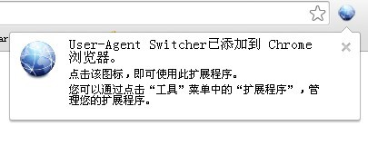
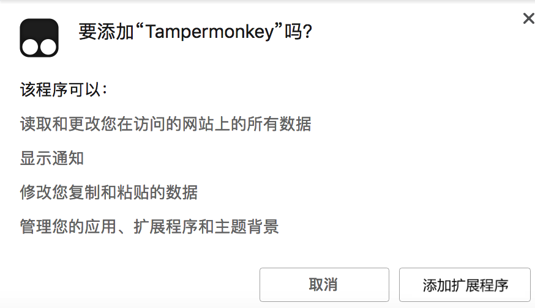
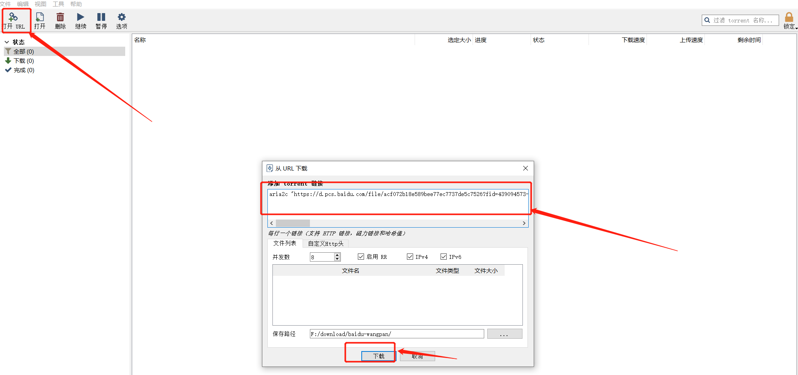

# 不限速下载

## 浏览器插件

**插件**（又译**外挂**，英文为**Plug-in**、**Plugin**、**add-in**、**addin**、**add-on**、**addon**或**extension**）是一种[电脑程序](https://link.zhihu.com/?target=https%3A//zh.wikipedia.org/wiki/%E7%94%B5%E8%84%91%E7%A8%8B%E5%BA%8F)，透过和应用程序（例如[网页浏览器](https://link.zhihu.com/?target=https%3A//zh.wikipedia.org/wiki/%E7%BD%91%E9%A1%B5%E6%B5%8F%E8%A7%88%E5%99%A8)，[电子邮件客户端](https://link.zhihu.com/?target=https%3A//zh.wikipedia.org/wiki/%E9%9B%BB%E5%AD%90%E9%83%B5%E4%BB%B6%E7%94%A8%E6%88%B6%E7%AB%AF)）的互动，用来替[应用程序](https://link.zhihu.com/?target=https%3A//zh.wikipedia.org/wiki/%E5%BA%94%E7%94%A8%E7%A8%8B%E5%BC%8F)增加一些所需要的特定的功能。最常见的有游戏、[网页浏览器](https://link.zhihu.com/?target=https%3A//zh.wikipedia.org/wiki/%E7%BD%91%E9%A1%B5%E6%B5%8F%E8%A7%88%E5%99%A8)的插件和[媒体播放器](https://link.zhihu.com/?target=https%3A//zh.wikipedia.org/wiki/%E5%AA%92%E4%BD%93%E6%92%AD%E6%94%BE%E5%99%A8)的插件。

通俗的来讲就是一个依附于主程序的辅助程序   要换成比较能理解的说法  就是 游戏里面的dlc

## 插件安装

### Chrome插件安装

怎么在谷歌浏览器中安装.crx扩展名的离线Chrome插件？`如果用户得到的离线版的Chrome插件文件（扩展名为.crx），该如何将其安装到谷歌浏览器Chrome中去呢？`

在用户使用谷歌浏览器安装Chrome插件的时候，如果网络状态允许或者用户直接在谷歌提供的服务中获取的Chrome插件，就可以点击其提供的一键跳转按钮直接根据提示安装到Chrome浏览器中，这种安装Chrome插件的方式最为简单，但是要求用户的网络状态良好，并且用户可以从谷歌的相关服务中获取Chrome插件的下载链接。

> **注意**：
>
> 有一部分网友反映子chrome 67版本以后以前离线安装chrome插件的方法无法使用，如果你在安装chrome插件时也出现此类问题，请参考[chrome 67版本后无法拖拽离线安装CRX格式插件的解决方法](https://huajiakeji.com/utilities/2018-09/1525.html)。

但是大多数情况我们的网络状态都不会允许我们这么做的，那我们更加不可能直接获取Chrome插件在谷歌服务中的下载链接了，用户只能通过在其他网站上下载（如：chrome插件网），或者用户通过好友之间分享获得Chrome插件的离线安装版（扩展名为.crx的文件）。

#### 第一步

首先用户点击谷歌浏览器右上角的自定义及控制按钮，在下拉框中选择工具选项，然后点击扩展程序来启动Chrome浏览器的扩展管理器页面。

#### 第二步

在打开的谷歌浏览器的扩展管理器中用户可以看到一些已经安装程序的Chrome插件，或者一个Chrome插件也没有。

#### 第三步

找到自己已经下载好的Chrome离线安装文件xxx.crx，然后将其从资源管理器中拖动到Chrome的扩展管理界面中，这时候用户会发现在扩展管理器的中央部分中会多出一个”拖动以安装“的插件按钮。

#### 第四步

松开鼠标就可以把当前正在拖动的插件安装到谷歌浏览器中去，但是谷歌考虑用户的安全隐私，在用户松开鼠标后还会给予用户一个确认安装的提示。

#### 第五步

用户这时候只需要点击添加按钮就可以把该离线Chrome插件安装到谷歌浏览器中去，安装成功以后该插件会立即显示在浏览器右上角（如果有插件按钮的话），如果没有插件按钮的话，用户还可以通过Chrome扩展管理器找到已经安装的插件。

用户只需要通过上面介绍的五个步骤就可以轻松地把离线谷歌浏览器插件安装到Chrome中去，希望这个离线Chrome插件的安装方法能够帮助到您或者是您的朋友。

如果通过上述方法安装Chrome插件的时候，谷歌浏览器提示“只能通过Chrome网上应用商店安装该程序”，可以参考：[解决“只能通过Chrome网上应用商店安装该程序”的方法](https://huajiakeji.com/utilities/2015-04/423.html)。

## 油猴插件

油猴插件_Tampermonkey油猴下载[直达下载](https://chrome.google.com/webstore/detail/tampermonkey/dhdgffkkebhmkfjojejmpbldmpobfkfo)`油猴插件是一款可以在chrome浏览器中使用油猴脚本的插件,能帮助用户轻松解决百度云下载难题。`

### 油猴插件概述

其实油猴插件有另外一个名字就是tampermonkey，那为什么什么喜欢称呼其为油猴插件呢！因为tampermonkey是是一款免费的浏览器扩展和最为流行的用户脚本管理器。是用来管理什么用户脚本的呢? 就是油猴脚本啦！所以人们也称tampermonkey为油猴插件。

油猴插件它适用于 Chrome, Microsoft Edge, Safari, Opera Next, 和 Firefox。 虽然有些受支持的浏览器拥有原生的用户脚本支持，但 Tampermonkey将在您的用户脚本管理方面提供更多的便利。它提供了诸如便捷脚本安装、自动更新检查、标签中的脚本运行状况速览、内置的编辑器等众多功能， 同时Tampermonkey还有可能正常运行原本并不兼容的脚本。 另外你感兴趣的Tampermonkey手机版也可下载

[tampermonkey手机安卓版_Tampermonkey Dolphin 4.2 APK](https://huajiakeji.com/android/2020-07/3346.html)tampermonkey安卓版是一款可以在手机上使用并拥有类似电脑上浏览器插件油猴一样功能的浏览器插件。[查看](https://huajiakeji.com/android/2020-07/3346.html)

### 油猴脚本是什么

油猴脚本是一段代码，它们能够优化您的网页浏览体验。安装之后，有些脚本能为网站添加新的功能，有些能使网站的界面更加易用，有些则能隐藏网站上烦人的部分内容。在 Greasy Fork 上的用户脚本都是由用户编写并向全世界发表的，您可以免费安装，轻松体验。

### 油猴插件怎么用

1.从本站下载油猴插件CRX文件。离线安装油猴插件的方法参照：chrome插件的离线安装方法。记得用最新(谷歌浏览器)。

也可以在浏览器输入chrome://extensions，进入浏览器的扩展程序界面，把“crx安装包”下载到桌面，然后打开Chrome右上角的菜单→更多工具→扩展程序页面，把“crx安装包”拖到页面里安装。

当你点击右上角的拼图看到这个就代表安装成功了

### 油猴插件有什么用

说起油猴插件的作用还真不少，不仅可以解决百度云盘限速、还能解决又打视频网站的vip会员，具体使用方法参照

### 油猴插件下载地址

- Chrome: [Tampermonkey](https://chrome.google.com/webstore/detail/tampermonkey/dhdgffkkebhmkfjojejmpbldmpobfkfo) 或 [Violentmonkey](https://chrome.google.com/webstore/detail/violent-monkey/jinjaccalgkegednnccohejagnlnfdag)
- Firefox: [Greasemonkey](https://addons.mozilla.org/firefox/addon/greasemonkey/)、[Tampermonkey](https://addons.mozilla.org/firefox/addon/tampermonkey/)
- Safari: [Tampermonkey](http://tampermonkey.net/?browser=safari) 或 [Userscripts](https://apps.apple.com/app/userscripts/id1463298887)
- Microsoft Edge: [Tampermonkey](https://www.microsoft.com/store/p/tampermonkey/9nblggh5162s)
- Opera: [Tampermonkey](https://addons.opera.com/extensions/details/tampermonkey-beta/)
- Maxthon: [Violentmonkey](http://extension.maxthon.com/detail/index.php?view_id=1680)
- Dolphin: [Tampermonkey](https://play.google.com/store/apps/details?id=net.tampermonkey.dolphin)
- UC: [Tampermonkey](https://www.tampermonkey.net/?browser=ucweb&ext=dhdg)

### 寻找用户脚本

当你安装好油猴子插件之后你会发现里面什么都没有，这个时候很多刚接触的汤友就会觉得这个插件没有任何用处，否定它，其实这说明你没有认真看第一篇文章，也没有理解究竟什么是用户脚本，什么是油猴子插件。

Tampermonkey（油猴子） 是一款免费的浏览器扩展和最为流行的用户脚本管理器，它是一个脚本管理器，它的强大之处是管理脚本，所以今天的重点就是在哪里寻找用户脚本，有哪有牛逼的用户脚本。

**1.Greasy Fork**

这是一个安全使用的用户脚本大全网站，这里拥有海量的用户脚本，重点是这个网站是支持中文，国内用户都能看的懂，而且在国内是可以直接打开的，脚本搜索下载也是非常简单的。

> [https://greasyfork.org/zh-CN](https://link.zhihu.com/?target=https%3A//greasyfork.org/zh-CN)

**2.userscripts**

这个网站拥有成千上万个免费的用户脚本，但是网站是英文网站，对于很多国内用户来说可能看不懂，所以大家可以安装一个网页翻译插件，当然现在很多浏览器都是支持自动翻译的，然后就可以搜索下载自己需要的用户脚本了。

> [https://userscripts-mirror.org/](https://link.zhihu.com/?target=https%3A//userscripts-mirror.org/)

**3.openuserjs**

这个网站和上面那个网站基本一样，同样拥有海量的用户脚本，但是整体数量没有第一个多，网站也是英文网站，对于不懂英语的人来说有点困难，同样需要安装一个翻译插件。

> [https://openuserjs.org/](https://link.zhihu.com/?target=https%3A//openuserjs.org/)

**4.GitHub和搜索引擎**

GitHub有很多大神分享用户脚本，但是很多都是代码，对于普通小白看不懂，所以这里就不再讲太多，要不然大家会觉得复杂，其实还有一个很简单的方法，你可以使用搜索引擎来搜索脚本资源,比如输入需要运行脚本的网站的主域名和后缀 ".user.js" 。

> [https://github.com/topics](https://link.zhihu.com/?target=https%3A//github.com/topics)

其实网上还有很多直接下载用户脚本的网站，谷歌或者百度搜索一下就有了，这里基本有这个四个就足够解决大家的所有问题了。

## 安装脚本

### 安装音乐一键下载

因为是第一个脚本，所以先讲个简单的。

#### 第一步

打开第一个脚本网站，在搜索框搜索音乐一键下载。

#### 第二步

会出现很多类似的插件，我们选择其中一个得分比较高，更新最新的用户脚本。

#### 第三步

点击脚本的链接打开，然后选择安装此脚本。

#### 第四步

然后点击左下角的安装按钮，即可直接安装成功。

#### 第五步

然后你可以点击油猴插件的图标找到管理面板，可以找到你安装的所有脚本。

#### 第六步

接着我们打开任意一个音乐网站，以网易云音乐为例。

#### 第七步

打开任意一首歌曲，你会发现网页会增加一个一键免费下载的按钮，接着点击就会跳转到对应的音乐解析网站，从而在各大平台中下载你想要的歌曲了，但是任何用户脚本都不一定保证100%成功。

到此为止用户脚本以及油猴插件的攻略已经全部讲解完毕，接下来就是大家自己摸索和学习的阶段了，这只是一个开始，一切都还并未结束

### 安装网盘直链下载助手

#### 第一阶段助手脚本

##### 第一步

打开第一个脚本网站，在搜索框搜索网盘。

##### 第二步

会出现很多类似的插件，我们选择其中一个得分比较高，更新最新的用户脚本。

##### 第三步

点击脚本的链接打开，然后选择安装此脚本。

##### 第四步

然后点击左下角的安装按钮，即可直接安装成功。

##### 第五步

然后你可以点击油猴插件的图标找到管理面板，可以找到你安装的所有脚本。

##### 第六步

接着我们打开网页版的百度网盘，会多一个下载助手。弹出页面不用管，直接叉掉。

##### 第七步

选中一个文件，点击下载助手你会发现有三个选项（API、Aria、RPC）。接下来说一中比较常见的下载方式，选择arin下载。

点击之后弹出一个界面，这个界面会有一个连接和一串很重要的提示信息。

#### 第二阶段万能助手

##### 第一步

接着上一步，点击网盘万能助手之后会出来一个页面，但是我已经下载好了，通过我共享的文件可以直接使用。

##### 第二步

下载到本地之后，点击`加载已解压的扩展程序`。选择`网盘万能助手 v2.3.2`文件夹，进行加载

加载完成之后会出现万能助手这个插件

#### 第三步阶段XDown

##### 第一步

接着第一阶段最后一步，点击XDown之后会出来一个页面，但是我已经下载好了，通过我共享的文件可以直接使用。

##### 第二步

因为是绿色版的直接解压就可以使用，解压后的目录：

点击XDown.exe，后会弹出对应的窗口。

#### 第四阶段测试下载

##### 第一步

接着第一阶段的最后一步，复制连接

##### 第二步

将复制的连接，粘贴到XDown中（点击打开URL----->复制连接到窗口中------>点击下载按钮）

最后可以看到下载速度一路高飞猛进

